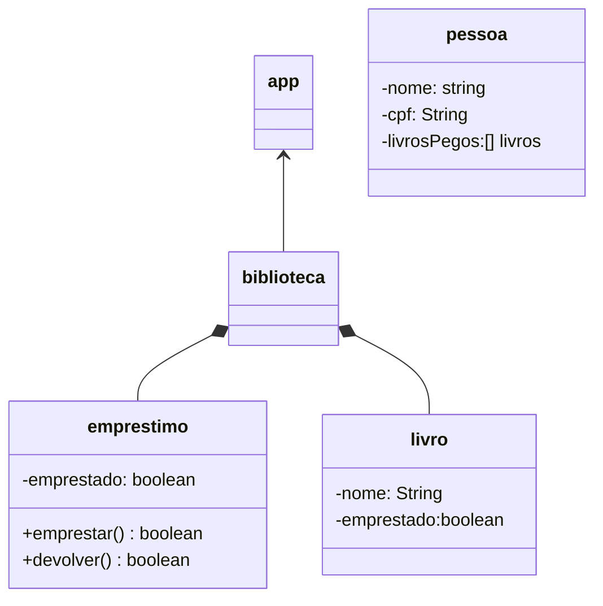
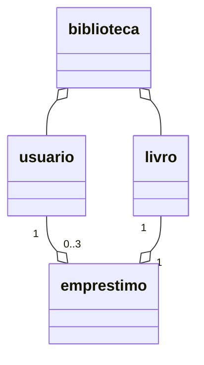

# Projeto de biblioteca

```mermaid
classDiagram
    biblioteca *-- emprestimo
    app <-- biblioteca
    biblioteca *-- livro
    
    pessoa
 
    class pessoa{
     -nome: string
     -cpf: String
     -livrosPegos:[] livros
 }
    class emprestimo{
        -emprestado: boolean
        +emprestar() boolean
        +devolver()boolean
 }
    class livro{
        -nome: String
        -emprestado:boolean
 }
 
    
  
  
  
 
```

```mermaid
classDiagram
    biblioteca o-- usuario
    biblioteca o-- livro
    usuario "1"--o "0..3"emprestimo 
    livro "1"--o "1"emprestimo
    
    
    
    
    
```