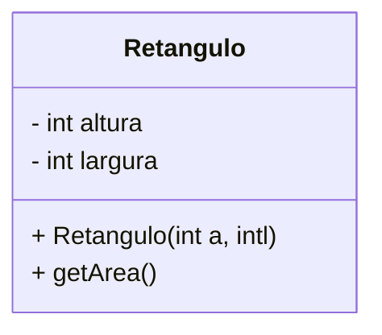
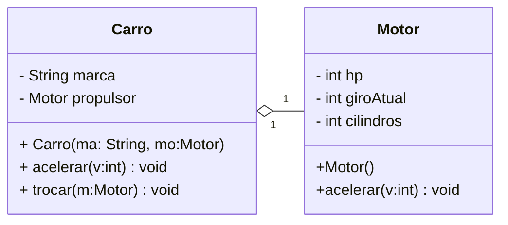

# Diagrama de Classe UML

```mermaid
classDiagram
    class Retangulo{
        - int altura
        - int largura
        + Retangulo(int a, intl)
        + getArea()
    }
```

```mermaid
classDiagram
    direction LR
    class Motor{
        - int hp
        - int giroAtual
        - int cilindros
        +Motor()
        +acelerar(v:int)void
    }
    class Carro{
        - String marca
        - Motor propulsor
        + Carro(ma: String, mo:Motor)
        + acelerar(v:int) void
        + trocar(m:Motor) void
    }
    
    Carro"1"o--"1"Motor 
    
```
