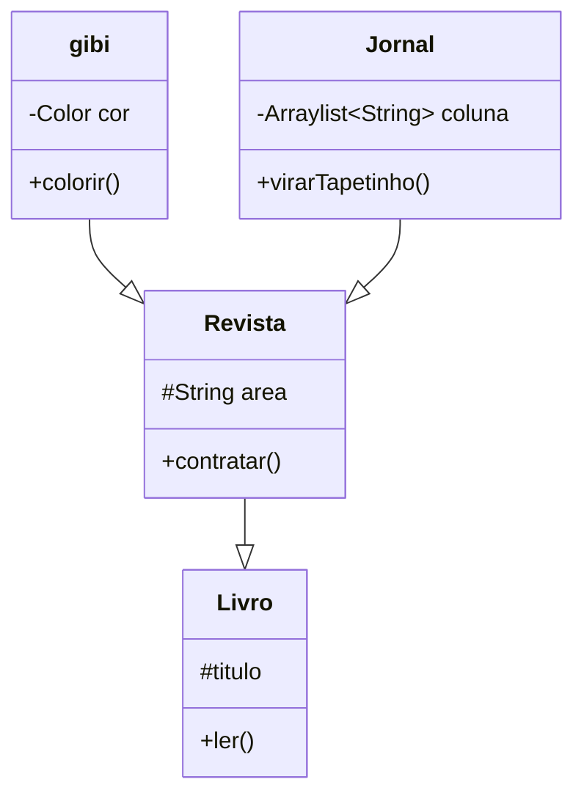

# UML texto

```mermaid
    classDiagram
        gibi--|> Revista
        Revista--|> Livro
        Jornal--|> Revista
        
        
        class Livro{
            #titulo
            +ler()
        }
        
        class Revista{
            #String area
            +contratar()
        }
        
        class Jornal{
            -Arraylist~String~ coluna
            +virarTapetinho()
        }
        
        class gibi{
            -Color cor
            +colorir()
        }


```