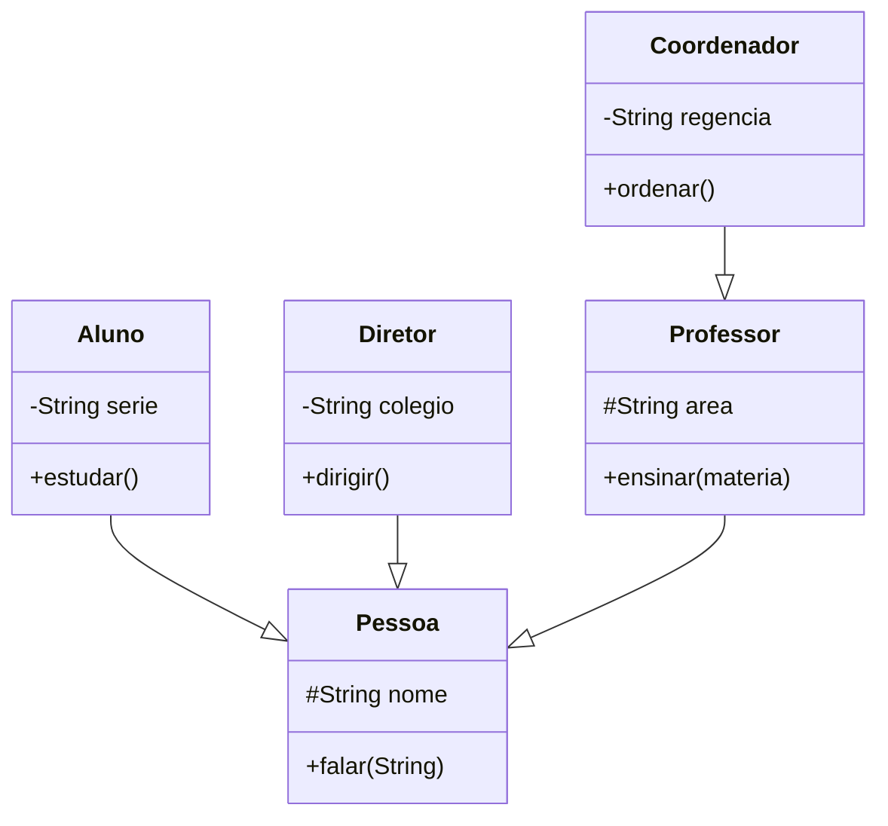

# UML Colegio

```mermaid

classDiagram
    
    Aluno --|> Pessoa
    Coordenador --|> Professor
    Diretor --|> Pessoa
    Professor --|> Pessoa

    
    class Pessoa{
        #String nome
        +falar(String)
        
 }
 
    class Aluno{
        -String serie
        +estudar()
 }
 
    class Professor{
        #String area
        +ensinar(materia)
 }
 
    class Coordenador{
        -String regencia 
        +ordenar()
        
 }
    class Diretor{
        -String colegio
        +dirigir()
 }


```