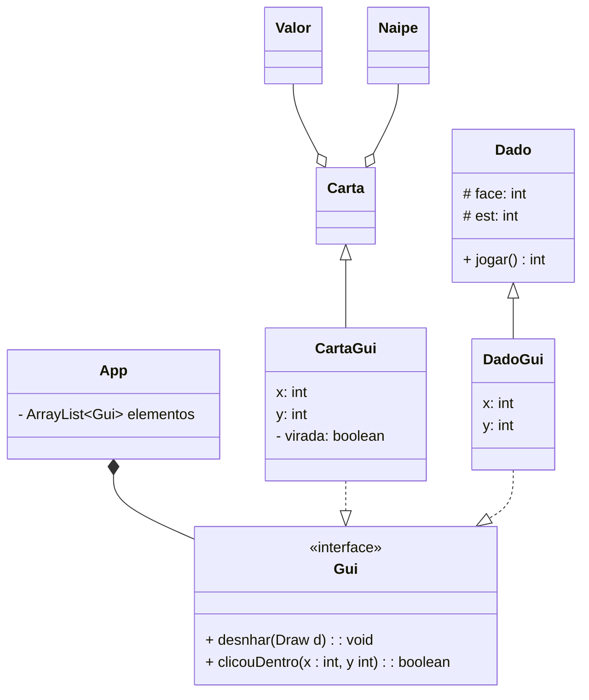

# Diagrama Da Classes Baralho.

```mermaid
classDiagram
    direction TB
    
    App *-- Gui
   
    Carta <|-- CartaGui
    Valor --o Carta
    Naipe --o Carta
    Dado <| -- DadoGui
    CartaGui ..|> Gui
    DadoGui ..|> Gui

    
    

    class App{
        - ArrayList~Gui~ elementos
    }
    
    class Dado{
        # face: int
        # est: int
        + jogar() int
    }
    
    class CartaGui{
        x: int
        y: int
        - virada: boolean
    }
    
    class DadoGui{
        x: int
        y: int
    }
    
    class Gui{
        <<interface>>
        + desnhar(Draw d): void
        + clicouDentro(x : int, y int) : boolean
 }
 


```