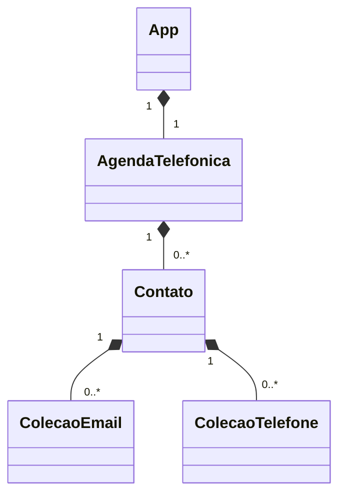

# Diagrama de Classes UML

```mermaid
classDiagram
    class AgendaTelefonica{ }
    class Contato{ }
    class App{ }
    class ColecaoTelefone{ }
    class ColecaoEmail{ }
    AgendaTelefonica "1" *-- "0..*" Contato
    App "1" *-- "1" AgendaTelefonica
    Contato "1" *-- "0..*" ColecaoEmail
    Contato "1" *-- "0..*" ColecaoTelefone
```