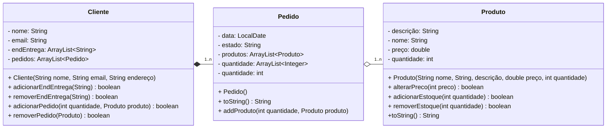

# Laboratorio 4 - Modelagem de Classes UML e associações

## Sistema de Comercio eletronico

```mermaid
classDiagram
    direction LR
  
    Pedido "" o--"1..n" Produto
    Cliente "" *--"1..n" Pedido
    class Produto{
        - descrição: String
        - nome: String
        - preço: double
        - quantidade: int
        + Produto(String nome, String, descrição, double preço, int quantidade)
        + alterarPreco(int preco) boolean
        + adicionarEstoque(int quantidade) boolean
        + removerEstoque(int quantidade) boolean     
        +toString() String
        }
    
    class Cliente{
        - nome: String
        - email: String
        - endEntrega: ArrayList~String~
        - pedidos: ArrayList~Pedido~
        + Cliente(String nome, String email, String endereço)
        + adicionarEndEntrega(String) boolean
        + removerEndEntrega(String) boolean
        + adicionarPedido(int quantidade, Produto produto) boolean
        + removerPedido(Produto) boolean
        }
    class Pedido{
        - data: LocalDate
        - estado: String
        - produtos: ArrayList~Produto~
        - quantidade: ArrayList~Integer~
        - quantidade: int
        + Pedido()
        + toString() String
        + addProduto(int quantidade, Produto produto)
    }


```