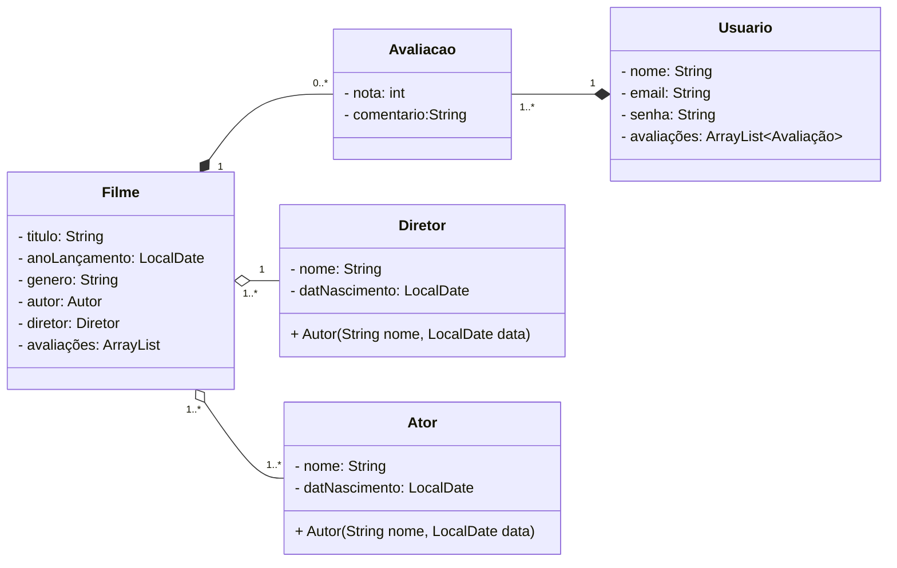

# Laboratorio 4 - Modelagem de Classes UML e associações

## Sistema de Avaliações de Filmes

```mermaid
classDiagram
    direction LR
    
    Avaliacao "1..*" --*"1" Usuario
    Filme "1..*"o--"1" Diretor
    Filme "1..*" o-- "1..*" Ator
    Filme "1" *-- "0..*" Avaliacao
    
    
    
    class Ator{
        - nome: String
        - datNascimento: LocalDate
        + Autor(String nome, LocalDate data)
    }
    class Diretor{
        - nome: String
        - datNascimento: LocalDate
        + Autor(String nome, LocalDate data)
    }
    class Usuario{
        - nome: String
        - email: String
        - senha: String
        - avaliações: ArrayList~Avaliação~
    }
    class Avaliacao{
        - nota: int
        - comentario:String
        
    }
    class Filme{
        - titulo: String
        - anoLançamento: LocalDate
        - genero: String
        - autor: Autor
        - diretor: Diretor
        - avaliações: ArrayList<Avaliacoes>
    }
    
    


```