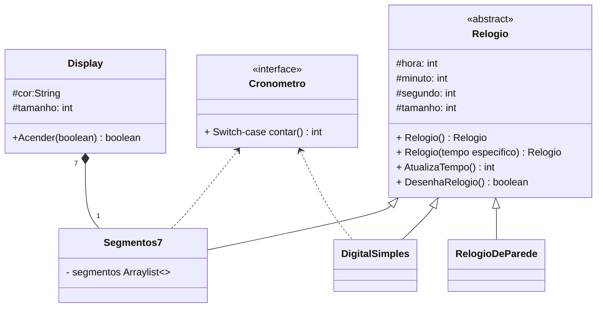

# Diagrama de classes Laboratório 6 de programação orientada a objetos com o professor Melo.

```mermaid
classDiagram

    Relogio <|-- Segmentos7
    Relogio <|-- DigitalSimples
    Relogio <|-- RelogioDeParede
    Cronometro <.. Segmentos7
    Cronometro <.. DigitalSimples
    Display "7"*--"1" Segmentos7


        
    class Relogio{
        <<abstract>>
        #hora: int
        #minuto: int
        #segundo: int
        #tamanho: int
        + Relogio() Relogio
        + Relogio (tempo especifico) Relogio
        + AtualizaTempo() int
        + DesenhaRelogio() boolean
    }
    
    class Segmentos7{
        - segmentos Arraylist<<Display>>
    }
    
    class DigitalSimples{
        
    }
    
    class RelogioDeParede{
        
    }
    
    class Cronometro{
        <<interface>>
        + Switch-case contar() int
    }  
    class Display{
        #cor:String
        #tamanho: int
        +Acender(boolean) boolean
    }

```

